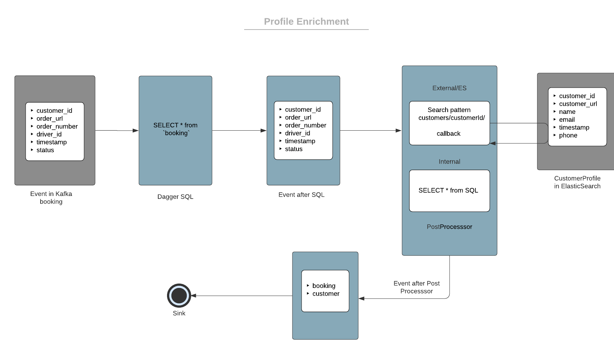

# Stream Enrichment

## What is Enrichment?

Enriching Data in motion is a relatively new concept and can be used as an alternative to streaming joins in many cases. Enriching your Data Stream enables the use of external data sources to fetch some additional information about each event in processing. You can use any external Data sources, Service endpoints, Object stores, Cache for enriching your stream. After the Data is enriched it gets sinked to downstream systems for further processing.

Streaming enrichment information is useful when you need enriched information in real-time rather than having to wait for a longer duration for bulk updates.

## Enrichment in Dagger

Dagger gives an easy configuration driven abstraction for enriching streamed events in Kafka. Using streaming enrichment with Dagger SQLs and Transformers make them powerful to use.

Streaming enrichment is wrapped as [Post Processors](update link), more specifically [External Post Processors](update link). All the network calls for Data enrichment over Data sources are non-blocking and happens in an Async fashion using callbacks. We use Flink's native Async IO Operators for this. All the basic parameters like timeouts, request count are configurable via Postprocessor configuration JSON.Read [here](https://ci.apache.org/projects/flink/flink-docs-release-1.9/dev/stream/operators/asyncio.html) about AsyncIO.

Currently, Dagger supports the following external Datasources for event enrichment.

- [ElasticSearch]()
- [Postgres]()
- [HTTP endpoints]()
- [GRPC endpoints]()

Note: If you want to support your desired data sources for enrichment feel free to contribute.

## Example of Enrichment in Dagger

In general streaming, enrichment can be used in a lot of places for solving some interesting business use cases. Explaining one of the generic use cases of profile enrichment that Dagger solves in this section.

### Problem Statement

Let's say you have a food delivery/e-commerce application. You want to enrich each booking event with some other static events from external data sources. The other information can be additional data points about a specific customer, merchant or driver/delivery partner which are updated to some external databases periodically or in near real-time. Dagger can fetch the profile informations from the Datasource based on some pattern/query.
The enriched stream information about booking can be used in multiple complex downstream applications like fraud detection, customer segmentation etc.

Dagger can solve this easily using simple SQL and post-processor. For the simplicity of this example we are assuming:

- The enrichment of only customer profile with booking information. However, user can have a chain of enrichments for enriching multiple data points.
- An ElasticSearch instance has all customer-specific information required which we are using as the external data source here and are indexed by customer ids for easy lookups.



This is how the basic data flow of profile enrichment looks like.

### Sample Schema Definition

Sample input schema for booking

```protobuf
message SampleBookingInfo {
  string order_number = 1;
  string order_url = 2;
  Status.Enum status = 3;
  google.protobuf.Timestamp event_timestamp = 4;
  string customer_id = 5;
  string driver_id = 6;
}
```

Sample Customer Profile schema

```protobuf
message SampleCustomerInfo {
    string customer_id = 1;
    string customer_url = 2;
    google.protobuf.Timestamp event_timestamp = 3
    string name = 4;
    string email = 5;
    string phone = 6;
    string profile_image_url = 7;
}
```

Enriched event schema which has detailed information about both booking and customers.

```protobuf
message EnrichedBookingInformation {
    SampleBookingInfo booking = 1;
    SampleCustomerInfo customer_profile = 2;
}
```

### Sample Configurations

Sample Query

```SQL
# here booking denotes the booking events stream with the sample input schema
SELECT * from `booking`
```

The Dagger SQL is just a select all statement from booking. This would be the
Sample Post Processor Configuration

```JSON
[{
  "internal_source": [
    {
      "output_field": "booking_log",
      "type": "sql",
      "value": "*"
    }
  ]
},
{
   "external_source":{
      "es":[
         {
            "host":"127.0.0.1",
            "port":"9200",
            "endpoint_pattern":"/customers/customer/%s",
            "endpoint_variables":"customer_id",
            "retry_timeout":"5000",
            "socket_timeout":"6000",
            "stream_timeout":"5000",
            "connect_timeout":"5000",
            "capacity":"30",
            "output_mapping":{
               "customer_profile":{
                  "path":"$._source"
               }
            }
         }
      ]
   }
}]
```

In the example Postprocessor configuration, the internal source instructs to populate the `booking_log` field of output schema using the SQL select statement and `customer_profile` from the fetched Documents of ES for a given customer. Follow [this](update link) for more details about each configuration fields.
